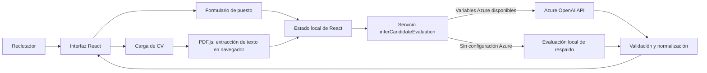

# Talentiq: arquitectura y alcance

**Trabajo práctico:** Inteligencia Artificial Aplicada  
**Entrega:** MVP  
**Grupo:** 2  
**Institución:** Universidad Nacional de La Matanza  
**Carrera y período:** Ingeniería en Informática, 2026, segundo cuatrimestre

## Integrantes

- Facundo Sebastián Acevedo
- Axel Joel Rodriguez Fenske
- Matías Agustín Delgado
- Rafael David Nazareno Ruiz
- Luis Pedro José Melissari
- Lautaro Agustín Terzano

**Repositorio de Azure DevOps:** [Talentiq](https://dev.azure.com/talentiq/talentiq)  
**Demo pública:** No desplegada a la fecha de esta documentación.

## Resumen

Talentiq es una aplicación web de apoyo a la preselección de candidatos. Compara los requisitos de una posición con la información de un CV y presenta un puntaje, un veredicto y un desglose de fortalezas y brechas. La herramienta busca hacer más explícitos y consistentes los criterios de comparación; no reemplaza la decisión humana de selección.

Este documento describe el MVP comprobable en el repositorio. Las capacidades de banco de talentos, persistencia y procesamiento de múltiples CVs no forman parte de esta versión.

## Problema y objetivo

La revisión manual de muchos CVs para una misma búsqueda puede consumir tiempo y producir evaluaciones poco consistentes. Talentiq busca agilizar la comparación inicial mediante requisitos ponderados y una evaluación asistida por IA.

El usuario principal es un reclutador que define un puesto, incorpora los requisitos relevantes y analiza un CV frente a esa posición.

## Alcance implementado

- Ingresar el nombre del puesto.
- Agregar y quitar habilidades requeridas, asignando a cada una un peso de 1 a 10.
- Seleccionar el seniority requerido y asignarle un peso.
- Cargar un único CV en formato PDF de hasta 5 MB.
- Extraer texto del PDF mediante PDF.js en el navegador.
- Calcular el puntaje obtenido respecto del total de puntos y mostrar un veredicto `Apto` o `No Apto`.
- Mostrar fortalezas y brechas detectadas.
- Cambiar entre tema claro y oscuro; la preferencia se guarda en `sessionStorage`.

El umbral de aprobación está fijado en 70 %. En ausencia de la configuración de Azure OpenAI, el servicio cuenta con una evaluación local de respaldo para probar el flujo.

## Fuera del MVP

- Persistencia de puestos, candidatos o resultados en una base de datos.
- Banco reutilizable de talentos o cruce de un candidato contra varias posiciones.
- Carga y evaluación masiva de CVs.
- Autenticación y gestión de usuarios.
- Seguimiento de candidatos en etapas de entrevista.
- Generación de preguntas de entrevista.
- Despliegue público: la demo aún no está desplegada.

La presentación identifica la carga masiva, el ranking comparativo, la autenticación y una mayor cobertura funcional como trabajo planificado para la entrega final, no como parte del MVP presentado.

## Flujo funcional

1. El reclutador define el rol, las habilidades ponderadas y el seniority requerido.
2. Carga el CV como PDF; el navegador extrae el texto del documento.
3. La aplicación valida que existan los requisitos y el contenido del CV.
4. El servicio de evaluación llama a Azure OpenAI si están disponibles todas las variables requeridas. Si no, usa la evaluación local de respaldo.
5. La respuesta se valida y normaliza para mostrar el porcentaje, el veredicto, las fortalezas y las brechas.

## Arquitectura lógica

La interfaz y la lógica principal se ejecutan en el navegador. Los requisitos, el texto del CV y el resultado se mantienen en el estado de React mientras la página está abierta. El tema claro/oscuro es la única preferencia de esta interfaz guardada en `sessionStorage`.

El repositorio contiene además `server/server.mjs`, un servidor Node.js auxiliar que expone `POST /api/import-job-requirements` para intentar extraer requisitos desde ofertas públicas de LinkedIn o Computrabajo y usar Azure OpenAI. El flujo principal de `App.tsx` no invoca actualmente ese endpoint.

## Componente inteligente

Cuando está configurado, `inferCandidateEvaluation` envía a Azure OpenAI los requisitos del puesto y el texto del CV y solicita una respuesta JSON con candidato, puntos obtenidos, puntos totales, veredicto, fortalezas y brechas. El servicio valida la estructura de la respuesta antes de mostrarla y normaliza algunos nombres de habilidades y descripciones.

El análisis local de respaldo calcula los puntos a partir de las habilidades encontradas y las reglas de seniority implementadas. Incluye variantes y alias de tecnologías y una inferencia aproximada de seniority a partir del texto del CV. La experiencia con Azure y el modelo/despliegue concretos dependen de la configuración local; no se exponen aquí valores de configuración ni credenciales.

## Datos y privacidad

- El navegador lee el PDF y extrae su texto con PDF.js.
- La aplicación conserva temporalmente el nombre del archivo y el texto extraído en el estado en memoria.
- No se persisten CVs, perfiles, posiciones ni resultados en una base de datos o bucket.
- Cuando Azure OpenAI está configurado, el texto del CV y los requisitos se envían al servicio de Azure para el análisis.
- El repositorio utiliza variables de entorno para la configuración. La clave con prefijo `VITE_` queda disponible al código cliente al compilar; por tanto, no debe tratarse como un secreto apto para un despliegue público.

Para una evolución de producción, las llamadas autenticadas a Azure deberían pasar por un backend que proteja las credenciales y defina controles de acceso, retención y eliminación de los datos personales.

## Tecnologías verificadas

| Área | Tecnología | Uso en el MVP |
|---|---|---|
| Interfaz | React 19, TypeScript y Vite | Aplicación web y flujo de usuario |
| Extracción PDF | `pdfjs-dist` | Lectura del texto de los PDF en el navegador |
| IA | Azure OpenAI API | Evaluación del CV frente a requisitos, si está configurada |
| Respaldo | TypeScript en el cliente | Evaluación local cuando no se dispone de Azure |
| API auxiliar | Node.js nativo | Importación de requisitos desde ofertas públicas; no integrada al flujo principal actual |
| Pruebas E2E | Playwright | Verificación de flujos de la interfaz |
| Lint | Oxlint | Análisis estático |

## Diferencias a tener en cuenta en la presentación

- La presentación describe una comparación semántica apoyada por LLM. El código solicita esa evaluación al modelo cuando está configurado, pero también puede ejecutar un respaldo local basado en reglas; ambas rutas deben distinguirse al explicar una demo concreta.
- La presentación marca para la entrega final la configuración de seniority y umbral. En el código actual se puede seleccionar el seniority requerido y su peso, mientras que el umbral de aprobación permanece fijo en 70 %.
- La presentación muestra un resultado ilustrativo de 87 %. No debe presentarse como resultado de una ejecución real salvo que se acompañe con la evidencia correspondiente.

## Referencias del repositorio

- `src/App.tsx`: estado y flujo de la aplicación.
- `src/components/JobRequirementsForm.tsx`: definición y ponderación del puesto.
- `src/components/CvUpload.tsx`: validación y extracción de texto PDF.
- `src/services/inferCandidateEvaluation.ts`: análisis local, llamada a Azure y validación de respuesta.
- `src/types.ts`: contratos de datos.
- `server/server.mjs`: API auxiliar de importación de requisitos.
- `tests/`: pruebas end-to-end del MVP.
- `package.json`: dependencias y comandos disponibles.

## Fuente y criterio de actualización

La información técnica se contrastó con el código, la configuración y las pruebas del repositorio. Los datos institucionales y la composición del Grupo 2 se tomaron de la presentación del MVP adjunta. Antes de la entrega final, actualizar este documento si el producto incorpora persistencia, procesamiento masivo, nuevas etapas de candidatos o despliegue.