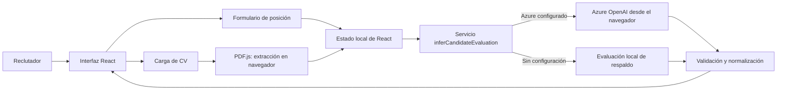
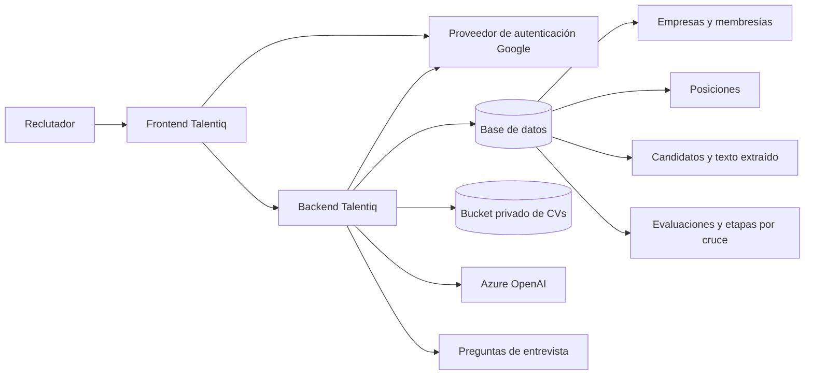

# Talentiq: arquitectura y alcance

**Trabajo práctico:** Inteligencia Artificial Aplicada
**Entrega:** Final — alcance acordado
**Grupo:** 2
**Institución:** Universidad Nacional de La Matanza
**Carrera y período:** Ingeniería en Informática, 2026, segundo cuatrimestre

## Integrantes

- Facundo Sebastián Acevedo
- Axel Joel Rodriguez Fenske
- Matías Agustín Delgado
- Rafael David Nazareno Ruiz
- Luis Pedro José Melissari
- Lautaro Agustín Terzano

**Repositorio de Azure DevOps:** [Talentiq](https://dev.azure.com/talentiq/talentiq)
**Demo pública:** No desplegada a la fecha de esta documentación.

## Resumen

Talentiq es una aplicación de apoyo a la preselección de candidatos. Para la entrega final, el alcance acordado es que cada empresa tenga un espacio privado compartido entre sus reclutadores, con posiciones persistentes, un banco reutilizable de CVs, evaluaciones independientes por cruce candidato–posición, seguimiento de etapas y preparación de entrevistas.

La evaluación asistida por IA ayuda a organizar la información, pero no reemplaza la decisión humana de selección. Este documento diferencia las capacidades actuales del MVP de las capacidades planificadas; el nuevo alcance no implica que ya estén implementadas.

El detalle de historias y criterios de aceptación está en [alcance-entrega-final-y-historias.md](./alcance-entrega-final-y-historias.md).

## Problema y objetivo

La revisión manual de CVs para distintas búsquedas puede consumir tiempo y producir evaluaciones poco consistentes. Talentiq busca agilizar la comparación inicial mediante requisitos ponderados y análisis asistido por IA, y facilitar el seguimiento del proceso dentro del espacio privado de cada empresa.

Los usuarios principales son reclutadores autenticados con Google. El primer reclutador crea la empresa y puede invitar a sus compañeros. Los candidatos son perfiles cuyos CVs se incorporan al banco de la empresa; no son usuarios autenticados de la aplicación en este alcance.

## Estado actual del MVP

El código comprobable en el repositorio actualmente permite:

- Ingresar el nombre del puesto.
- Agregar y quitar habilidades requeridas con un peso individual de 1 a 10.
- Seleccionar el seniority requerido y asignarle un peso.
- Cargar un CV PDF individual de hasta 5 MB.
- Extraer el texto del PDF en el navegador con PDF.js.
- Calcular y mostrar un resultado con veredicto `Apto` o `No Apto`, fortalezas y brechas.
- Cambiar entre tema claro y oscuro; la preferencia se guarda en `sessionStorage`.

Los requisitos, el nombre y texto del CV y el resultado de la evaluación viven en el estado React durante la sesión; no se guardan en una base de datos o bucket. El umbral de aprobación está fijado en 70 %. Si faltan las variables de Azure OpenAI, el flujo actual puede recurrir a una evaluación local.

## Alcance acordado para la entrega final

- Registro e inicio de sesión de reclutadores con Google, mediante un proveedor de autenticación que debe seleccionarse.
- Creación de una empresa por el primer reclutador e invitación de sus compañeros.
- Banco de CVs compartido entre miembros de la misma empresa y aislado frente a otras empresas.
- Posiciones persistentes con requisitos, ponderaciones y estado propio: `Nueva`, `Abierta`, `Cubierta` o `Cancelada`.
- Perfiles de candidatos persistentes con metadatos del CV, texto extraído y referencia al archivo.
- Almacenamiento de archivos en un bucket privado.
- Carga de múltiples CVs con progreso y errores informados por candidato/archivo, sin que un error individual interrumpa el resto del lote.
- Cruces persistentes de un candidato contra una o más posiciones abiertas, con resultado independiente para cada relación.
- Etapa de cada candidato por posición: `Evaluado`, `En entrevista` o `Descartado`.
- Generación de preguntas de entrevista basada en los requisitos de la posición y las fortalezas o brechas del candidato en ese cruce.
- Llamadas a Azure OpenAI desde el backend, con secretos protegidos fuera del bundle frontend.
- Despliegue accesible y prueba de un flujo funcional integrado como objetivo de entrega.

## Reglas de dominio

- La posición tiene su propio estado; el candidato tiene una etapa independiente para cada posición.
- Un candidato puede estar vinculado con distintas posiciones y tener resultados y etapas diferentes en cada una.
- La pertenencia al banco de candidatos corresponde a una empresa; los CVs no se comparten entre empresas en el alcance acordado.
- Una evaluación corresponde a una relación candidato–posición y conserva puntaje, veredicto, fortalezas, brechas y fecha.
- Cambiar el estado de la posición no modifica automáticamente las etapas de los candidatos.
- Las operaciones sobre datos y archivos deben validar autorización en el backend; esconder elementos en la UI no constituye aislamiento.
- La generación de preguntas usa únicamente el cruce candidato–posición elegido.
- Los errores de persistencia, almacenamiento y servicios de IA deben exponerse al usuario y no convertirse en resultados con apariencia de éxito.

## Modelo funcional de referencia

| Entidad | Responsabilidad y relaciones |
|---|---|
| Empresa | Espacio privado al que pertenecen los datos de posiciones y candidatos. |
| Reclutador | Usuario autenticado mediante Google. |
| Membresía | Relación entre una cuenta de reclutador y una empresa; representa acceso al espacio. |
| Posición | Pertenece a una empresa y conserva requisitos, ponderaciones y estado. |
| Candidato | Perfil del banco de una empresa, con metadatos de CV, texto extraído y referencia al objeto privado. |
| Evaluación candidato–posición | Relaciona un candidato con una posición de la misma empresa; conserva resultado y etapa de ese cruce. |
| Preguntas de entrevista | Se asocian a la evaluación candidato–posición que las contextualiza. |

La autenticación de Google identifica al reclutador; no se deben almacenar las credenciales de Google en Talentiq. La base de datos conserva la identidad necesaria y la membresía, mientras que el binario del CV se almacena en el bucket privado.

## Arquitectura actual y objetivo

### Arquitectura actual del MVP

```mermaid
flowchart LR
    R[Reclutador] --> UI[Interfaz React]
    UI --> F[Formulario de posición]
    UI --> U[Carga de CV]
    U --> PDF[PDF.js: extracción en navegador]
    F --> S[Estado local de React]
    PDF --> S
    S --> E[Servicio inferCandidateEvaluation]
    E -->|Azure configurado| AOAI[Azure OpenAI desde el navegador]
    E -->|Sin configuración| FB[Evaluación local de respaldo]
    AOAI --> V[Validación y normalización]
    FB --> V
    V --> UI
```

La aplicación principal mantiene posición, CV y evaluación en memoria. `server/server.mjs` es un servidor auxiliar Node.js que expone `POST /api/import-job-requirements` para importar requisitos desde ofertas públicas de LinkedIn o Computrabajo; no implementa el flujo principal de evaluación ni persistencia.

### Arquitectura objetivo (proveedores por definir)

```mermaid
flowchart LR
    R[Reclutador] --> UI[Frontend Talentiq]
    UI --> AUTH[Proveedor de autenticación Google]
    UI --> API[Backend Talentiq]
    API --> AUTH
    API --> DB[(Base de datos)]
    API --> B[(Bucket privado de CVs)]
    API --> AOAI[Azure OpenAI]
    DB --> ORG[Empresas y membresías]
    DB --> JOB[Posiciones]
    DB --> CAND[Candidatos y texto extraído]
    DB --> EVAL[Evaluaciones y etapas por cruce]
    API --> Q[Preguntas de entrevista]
```

Esta arquitectura es una guía de responsabilidades, no una decisión de proveedor ni una implementación ya existente. El backend debe comprobar membresía y autorización en cada acceso a la base y a los archivos. El frontend no debe comunicarse directamente con Azure OpenAI usando una clave secreta.

## IA y procesamiento

En el MVP actual, `inferCandidateEvaluation` envía requisitos y texto del CV a Azure OpenAI desde el cliente cuando están configuradas las variables correspondientes. El resultado se valida y normaliza; también hay una ruta de evaluación local de respaldo. La integración real con Azure no se considera garantizada por las pruebas E2E actuales.

Para la entrega final, la evaluación y la generación de preguntas deben solicitarse al backend. El backend protege la clave, valida la entrada y respuesta del modelo, asocia cada resultado con la empresa y el cruce correctos, y devuelve errores explícitos si el servicio falla. No debe exponer la clave en variables `VITE_*` ni en recursos compilados para el navegador.

La carga masiva procesa cada CV de manera individual. El sistema debe registrar e informar progreso y resultado de cada archivo, y continuar con los demás ante un fallo individual. La extracción actual en navegador solo contempla PDF y el límite actual de 5 MB; los formatos, límites y tratamiento de documentos escaneados para la entrega final están pendientes de definición.

## Datos y privacidad

### Situación actual

- El navegador extrae el texto del PDF.
- El nombre del archivo y el texto extraído se conservan temporalmente en memoria.
- No hay persistencia de perfiles, posiciones o resultados en base de datos ni almacenamiento de archivos en bucket.
- La llamada configurada a Azure OpenAI desde el frontend transmite el texto del CV y los requisitos a Azure.
- Una clave `VITE_*` queda disponible al código cliente al compilar y no es apta como secreto en producción.

### Requisito para la entrega final

- Cada perfil, posición y evaluación debe pertenecer al espacio de una empresa y las empresas deben permanecer aisladas.
- El archivo del CV se almacena en un bucket privado; la base de datos conserva sus metadatos, el texto extraído y la referencia al archivo.
- El backend valida que la persona autenticada sea miembro autorizado de la empresa antes de consultar, modificar o servir el CV.
- Las credenciales de Azure OpenAI y otros servicios se configuran como secretos del backend.
- Deben definirse consentimiento, acceso, retención, eliminación y tratamiento de datos personales antes del despliegue.

## Tecnologías verificadas en el repositorio actual

| Área | Tecnología | Uso actual |
|---|---|---|
| Interfaz | React 19, TypeScript y Vite | Aplicación web y flujo del MVP |
| Extracción PDF | `pdfjs-dist` | Lectura del texto de PDF en el navegador |
| IA | Azure OpenAI API | Evaluación del CV si está configurada en el cliente |
| Respaldo | TypeScript en el cliente | Evaluación local si no se dispone de Azure |
| API auxiliar | Node.js nativo | Importación de requisitos desde ofertas públicas; independiente del flujo principal |
| Pruebas E2E | Playwright | Pruebas de la interfaz del MVP |
| Lint | Oxlint | Análisis estático |

Base de datos, proveedor de autenticación, bucket privado y hosting para la arquitectura objetivo aún no están seleccionados ni implementados.

## Pruebas y despliegue

Las pruebas actuales cubren la definición de requisitos, carga de un PDF, análisis de un CV y cambio de tema. No cubren autenticación, aislamiento de empresas, persistencia, carga masiva, cruces reutilizables, etapas por relación, generación de preguntas ni servicios desplegados.

Para la entrega final se deberá ampliar la cobertura con pruebas de esos flujos, incluyendo errores de acceso y fallos parciales de lote. El despliegue debe verificarse en una URL accesible mediante un flujo integrado que compruebe autenticación, backend, persistencia y acceso autorizado al CV. La documentación de pruebas debe distinguir los servicios simulados de los servicios reales.

## Decisiones pendientes

- Proveedor de autenticación con Google, base de datos, bucket privado y plataforma de hosting.
- Si una cuenta puede pertenecer a más de una empresa y cómo cambia entre espacios.
- Roles y permisos de miembros, incluida la capacidad de invitar compañeros.
- Método, duración y revocación de invitaciones.
- Detección de candidatos duplicados dentro de una empresa.
- Si un nuevo análisis reemplaza el resultado previo o conserva historial de versiones.
- Formatos y tamaños admitidos, tratamiento de CVs escaneados y texto no extraíble.
- Consentimiento, retención, exportación y eliminación de CVs y datos personales.
- Requisitos de acceso para la demo pública y datos de prueba.

## Referencias del repositorio

- `PROJECT_CONTEXT.md`: contexto general y diferencia entre alcance acordado y estado implementado.
- `src/App.tsx`: estado y flujo actual de la aplicación.
- `src/components/JobRequirementsForm.tsx`: definición y ponderación del puesto.
- `src/components/CvUpload.tsx`: validación y extracción actual de texto PDF.
- `src/services/inferCandidateEvaluation.ts`: evaluación local, llamada actual a Azure y validación.
- `src/types.ts`: contratos de datos actuales.
- `server/server.mjs`: API auxiliar actual para importar requisitos.
- `tests/`: pruebas end-to-end existentes.
- `package.json`: dependencias y comandos disponibles.
- [Alcance y propuestas de HU](./alcance-entrega-final-y-historias.md): decisiones acordadas, modelo funcional, historias y criterios propuestos.

## Fuente y criterio de actualización

La descripción del estado actual se contrastó con el código, la configuración y las pruebas del repositorio. Los datos institucionales y la composición del Grupo 2 se conservan de la documentación previa. Actualizar las secciones de estado actual, arquitectura, privacidad y pruebas cuando las capacidades pendientes se implementen y se verifiquen; no marcar como entregada una capacidad solo porque figure en el alcance o en una HU.
