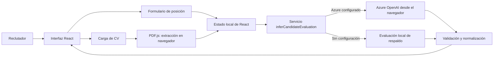
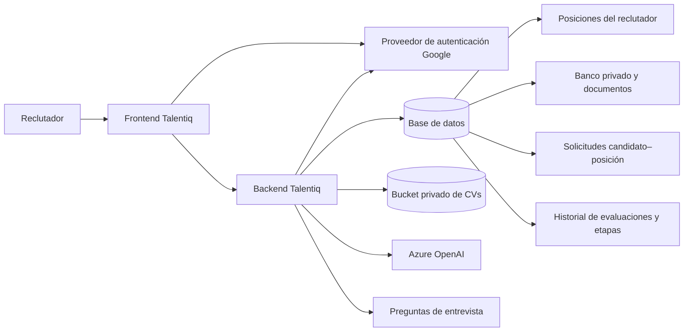

# Talentiq: arquitectura y alcance

**Trabajo práctico:** Inteligencia Artificial Aplicada
**Entrega:** Final — alcance acordado
**Grupo:** 2
**Institución:** Universidad Nacional de La Matanza
**Carrera y período:** Ingeniería en Informática, 2026, segundo cuatrimestre

## Integrantes

- Facundo Sebastián Acevedo
- Axel Joel Rodriguez Fenske
- Matías Agustín Delgado
- Rafael David Nazareno Ruiz
- Luis Pedro José Melissari
- Lautaro Agustín Terzano

**Repositorio de Azure DevOps:** [Talentiq](https://dev.azure.com/talentiq/talentiq)
**Demo pública:** No desplegada a la fecha de esta documentación.

## Resumen

Talentiq es una aplicación de apoyo a la preselección de candidatos. Para la entrega final, el alcance acordado es que cada reclutador autenticado tenga un espacio privado con posiciones persistentes, un banco reutilizable de CVs, solicitudes candidato–posición, historial de evaluaciones, seguimiento de etapas y preparación de entrevistas.

La evaluación asistida por IA ayuda a organizar la información, pero no reemplaza la decisión humana de selección. Este documento diferencia las capacidades actuales del MVP de las capacidades planificadas; el nuevo alcance no implica que ya estén implementadas.

El detalle de historias y criterios de aceptación está en [alcance-entrega-final-y-historias.md](./alcance-entrega-final-y-historias.md).

## Problema y objetivo

La revisión manual de CVs para distintas búsquedas puede consumir tiempo y producir evaluaciones poco consistentes. Talentiq busca agilizar la comparación inicial mediante requisitos ponderados y análisis asistido por IA, y facilitar el seguimiento de solicitudes dentro del espacio privado del reclutador.

Los usuarios principales son reclutadores autenticados con Google. En esta etapa cada reclutador administra sus propias vacantes y su banco privado; no se incluyen empresas, invitaciones ni colaboración entre cuentas. Los candidatos son perfiles cuyos CVs se incorporan al banco del reclutador; no son usuarios autenticados de la aplicación en este alcance.

## Estado actual del MVP

El código comprobable en el repositorio actualmente permite:

- Ingresar el nombre del puesto.
- Agregar y quitar habilidades requeridas con un peso individual de 1 a 10.
- Seleccionar el seniority requerido y asignarle un peso.
- Cargar un CV PDF individual de hasta 5 MB.
- Extraer el texto del PDF en el navegador con PDF.js.
- Calcular y mostrar un resultado con veredicto `Apto` o `No Apto`, fortalezas y brechas.
- Cambiar entre tema claro y oscuro; la preferencia se guarda en `sessionStorage`.

Los requisitos, el nombre y texto del CV y el resultado de la evaluación viven en el estado React durante la sesión; no se guardan en una base de datos o bucket. El umbral de aprobación está fijado en 70 %. Si faltan las variables de Azure OpenAI, el flujo actual puede recurrir a una evaluación local.

## Alcance acordado para la entrega final

- Registro e inicio de sesión de reclutadores con Google, mediante un proveedor de autenticación que debe seleccionarse.
- Posiciones persistentes propiedad del reclutador, con requisitos, ponderaciones y estado propio: `Nueva`, `Abierta`, `Cubierta` o `Cancelada`.
- Banco de CVs privado por reclutador, con perfiles persistentes, metadatos, texto extraído y referencia al archivo.
- Almacenamiento de archivos en un bucket privado.
- Carga de múltiples CVs con progreso y errores informados por candidato/archivo, sin que un error individual interrumpa el resto del lote.
- Solicitudes persistentes que vinculan candidatos y posiciones abiertas del mismo reclutador.
- Historial de evaluaciones por solicitud y etapa independiente de cada candidato para cada posición: `Evaluado`, `En entrevista` o `Descartado`.
- Generación de preguntas de entrevista basada en los requisitos de la posición y las fortalezas o brechas del candidato en ese cruce.
- Llamadas a Azure OpenAI desde el backend, con secretos protegidos fuera del bundle frontend.
- Despliegue accesible y prueba de un flujo funcional integrado como objetivo de entrega.

## Reglas de dominio

- La posición tiene su propio estado; el candidato tiene una etapa independiente para cada posición.
- Un candidato puede estar vinculado con distintas posiciones y tener resultados y etapas diferentes en cada una.
- Cada posición y candidato pertenecen a un reclutador; los CVs no se comparten entre cuentas en el alcance acordado.
- Una solicitud corresponde a una pareja candidato–posición; cada ejecución conserva puntaje, veredicto, fortalezas, brechas y fecha.
- Cambiar el estado de la posición no modifica automáticamente las etapas de los candidatos.
- Las operaciones sobre datos y archivos deben validar autorización en el backend; esconder elementos en la UI no constituye aislamiento.
- La generación de preguntas usa únicamente el cruce candidato–posición elegido.
- Los errores de persistencia, almacenamiento y servicios de IA deben exponerse al usuario y no convertirse en resultados con apariencia de éxito.

## Modelo funcional de referencia

| Entidad | Responsabilidad y relaciones |
|---|---|
| Reclutador | Usuario autenticado mediante Google y propietario del espacio privado. |
| Posición | Pertenece a un reclutador y conserva requisitos, ponderaciones y estado. |
| Candidato | Perfil del banco privado del reclutador, con metadatos de CV, texto extraído y referencia al objeto privado. |
| Documento de candidato | Archivo CV privado y sus metadatos, texto extraído y estado de procesamiento. |
| Solicitud candidato–posición | Vincula un candidato y una posición del mismo reclutador; conserva la etapa del proceso. |
| Ejecución de evaluación | Resultado histórico de una solicitud. |
| Preguntas de entrevista | Se asocian a una ejecución concreta que aporta el contexto del candidato y de la posición. |

La autenticación de Google identifica al reclutador; no se deben almacenar las credenciales de Google en Talentiq. Las tablas y objetos privados quedan asociados a su identidad autenticada. El binario del CV se almacena en el bucket privado.

## Arquitectura actual y objetivo

### Arquitectura actual del MVP

```mermaid
flowchart LR
    R[Reclutador] --> UI[Interfaz React]
    UI --> F[Formulario de posición]
    UI --> U[Carga de CV]
    U --> PDF[PDF.js: extracción en navegador]
    F --> S[Estado local de React]
    PDF --> S
    S --> E[Servicio inferCandidateEvaluation]
    E -->|Azure configurado| AOAI[Azure OpenAI desde el navegador]
    E -->|Sin configuración| FB[Evaluación local de respaldo]
    AOAI --> V[Validación y normalización]
    FB --> V
    V --> UI
```

La aplicación principal mantiene posición, CV y evaluación en memoria. `server/server.mjs` es un servidor auxiliar Node.js que expone `POST /api/import-job-requirements` para importar requisitos desde ofertas públicas de LinkedIn o Computrabajo; no implementa el flujo principal de evaluación ni persistencia.

### Arquitectura objetivo (proveedores por definir)

```mermaid
flowchart LR
    R[Reclutador] --> UI[Frontend Talentiq]
    UI --> AUTH[Proveedor de autenticación Google]
    UI --> API[Backend Talentiq]
    API --> AUTH
    API --> DB[(Base de datos)]
    API --> B[(Bucket privado de CVs)]
    API --> AOAI[Azure OpenAI]
    DB --> JOB[Posiciones del reclutador]
    DB --> CAND[Banco privado y documentos]
    DB --> APP[Solicitudes candidato–posición]
    DB --> EVAL[Historial de evaluaciones y etapas]
    API --> Q[Preguntas de entrevista]
```

Esta arquitectura es una guía de responsabilidades, no una implementación ya existente. Supabase está configurado para autenticación, base de datos y almacenamiento. Las políticas deben comprobar que la identidad autenticada sea propietaria de cada posición, candidato, solicitud y archivo. El frontend no debe comunicarse directamente con Azure OpenAI usando una clave secreta.

## IA y procesamiento

En el MVP actual, `inferCandidateEvaluation` envía requisitos y texto del CV a Azure OpenAI desde el cliente cuando están configuradas las variables correspondientes. El resultado se valida y normaliza; también hay una ruta de evaluación local de respaldo. La integración real con Azure no se considera garantizada por las pruebas E2E actuales.

Para la entrega final, la evaluación y la generación de preguntas deben solicitarse al backend. El backend protege la clave, valida la entrada y respuesta del modelo, asocia cada resultado a la solicitud del reclutador correcto y devuelve errores explícitos si el servicio falla. Cada reanálisis conserva una nueva ejecución histórica. No debe exponer la clave en variables `VITE_*` ni en recursos compilados para el navegador.

La carga masiva procesa cada CV de manera individual. El sistema debe registrar e informar progreso y resultado de cada archivo, y continuar con los demás ante un fallo individual. La extracción actual en navegador solo contempla PDF y el límite actual de 5 MB; los formatos, límites y tratamiento de documentos escaneados para la entrega final están pendientes de definición.

## Datos y privacidad

### Situación actual

- El navegador extrae el texto del PDF.
- El nombre del archivo y el texto extraído se conservan temporalmente en memoria.
- Los puestos y sus ponderaciones se cargan desde Supabase; guardado/actualización usa una función transaccional que debe aplicarse en la instancia.
- No hay persistencia de perfiles o resultados ni almacenamiento de archivos en bucket desde la aplicación.
- La llamada configurada a Azure OpenAI desde el frontend transmite el texto del CV y los requisitos a Azure.
- Una clave `VITE_*` queda disponible al código cliente al compilar y no es apta como secreto en producción.

### Requisito para la entrega final

- Cada perfil, posición y evaluación debe pertenecer a un reclutador y permanecer aislado de las demás cuentas.
- El archivo del CV se almacena en un bucket privado; la base de datos conserva sus metadatos, el texto extraído y la referencia al archivo.
- Las políticas y el backend validan que la identidad autenticada sea propietaria del registro antes de consultar, modificar o servir el CV.
- Las credenciales de Azure OpenAI y otros servicios se configuran como secretos del backend.
- Deben definirse consentimiento, acceso, retención, eliminación y tratamiento de datos personales antes del despliegue.

## Tecnologías verificadas en el repositorio actual

| Área | Tecnología | Uso actual |
|---|---|---|
| Interfaz | React 19, TypeScript y Vite | Aplicación web y flujo del MVP |
| Extracción PDF | `pdfjs-dist` | Lectura del texto de PDF en el navegador |
| IA | Azure OpenAI API | Evaluación del CV si está configurada en el cliente |
| Respaldo | TypeScript en el cliente | Evaluación local si no se dispone de Azure |
| API auxiliar | Node.js nativo | Importación de requisitos desde ofertas públicas; independiente del flujo principal |
| Pruebas E2E | Playwright | Pruebas de la interfaz del MVP |
| Lint | Oxlint | Análisis estático |

La migración inicial `supabase/migrations/20261002203000_initial_private_recruiter_schema.sql` se aplicó en el proyecto Supabase del usuario. La consulta a `pg_policies` confirma las políticas RLS `SELECT`, `INSERT` y `UPDATE` para `positions` y `position_skills`, restringidas a `auth.uid()`. El usuario también confirmó Google OAuth y el bucket `candidate-cvs` con políticas para `INSERT`, `SELECT` y `UPDATE`. La app consulta la lista de puestos; para guardar o actualizar el puesto y sus habilidades de manera atómica, debe aplicarse la migración adicional `supabase/migrations/20261003214000_save_position_rpc.sql`. Aún no se ha validado una operación de escritura contra la instancia real.

## Pruebas y despliegue

Las pruebas actuales cubren la definición de requisitos, carga de un PDF, análisis de un CV y cambio de tema. No cubren autenticación, aislamiento entre reclutadores, persistencia, carga masiva, solicitudes reutilizables, historial, etapas por solicitud, generación de preguntas ni servicios desplegados.

Para la entrega final se deberá ampliar la cobertura con pruebas de esos flujos, incluyendo errores de acceso y fallos parciales de lote. El despliegue debe verificarse en una URL accesible mediante un flujo integrado que compruebe autenticación, backend, persistencia y acceso autorizado al CV. La documentación de pruebas debe distinguir los servicios simulados de los servicios reales.

## Decisiones pendientes

- Plataforma de hosting.
- Detección de candidatos duplicados dentro del banco de un reclutador.
- Formatos y tamaños admitidos, tratamiento de CVs escaneados y texto no extraíble.
- Consentimiento, retención, exportación y eliminación de CVs y datos personales.
- Requisitos de acceso para la demo pública y datos de prueba.
- Si en una etapa futura se requerirán empresas, bancos compartidos e invitaciones entre reclutadores.

## Referencias del repositorio

- `PROJECT_CONTEXT.md`: contexto general y diferencia entre alcance acordado y estado implementado.
- `src/App.tsx`: estado y flujo actual de la aplicación.
- `src/components/JobRequirementsForm.tsx`: definición y ponderación del puesto.
- `src/components/CvUpload.tsx`: validación y extracción actual de texto PDF.
- `src/services/inferCandidateEvaluation.ts`: evaluación local, llamada actual a Azure y validación.
- `src/types.ts`: contratos de datos actuales.
- `server/server.mjs`: API auxiliar actual para importar requisitos.
- `supabase/migrations/20261002203000_initial_private_recruiter_schema.sql`: migración inicial aplicada en el proyecto Supabase del usuario.
- `supabase/migrations/20261003214000_save_position_rpc.sql`: función transaccional para guardar puestos y ponderaciones; requiere aplicación en el proyecto.
- `tests/`: pruebas end-to-end existentes.
- `package.json`: dependencias y comandos disponibles.
- [Alcance y propuestas de HU](./alcance-entrega-final-y-historias.md): decisiones acordadas, modelo funcional, historias y criterios propuestos.

## Fuente y criterio de actualización

La descripción del estado actual se contrastó con el código, la configuración y las pruebas del repositorio. Los datos institucionales y la composición del Grupo 2 se conservan de la documentación previa. Actualizar las secciones de estado actual, arquitectura, privacidad y pruebas cuando las capacidades pendientes se implementen y se verifiquen; no marcar como entregada una capacidad solo porque figure en el alcance o en una HU.
